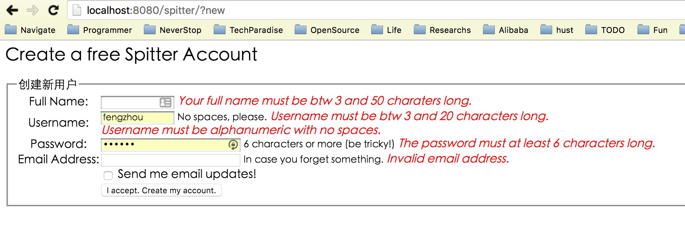
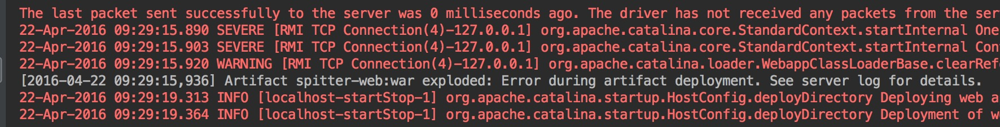
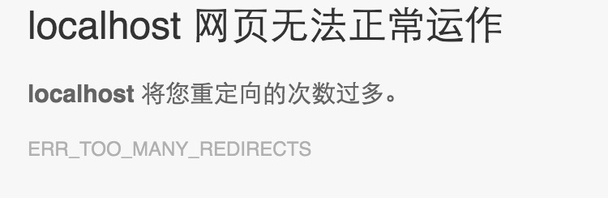

# Spring In Action 3rd
---

2016.3.31  阅读《Spring实战3rd》

之前间歇的阅读过，但是只是停留在理解的层面上，想要把每个例子跑通也需要一定的折腾。

注：每个示例都是一个单独的project。

## 1. Spring之旅

* 依赖注入
* AOP
* bean的初始化过程
* spring容器
* Spring还有很多值得学习的框架，如安全

**跑起来√**[knights](https://github.com/vonzhou/SpringInAction3/tree/master/knights/src/main/java/com/vonzhou/springinaction/knights)

## 2. 装配Bean

* “initialization on demand holder”创建单例模式的理解,参考 [Initialization-on-demand holder idiom](https://en.wikipedia.org/wiki/Initialization-on-demand_holder_idiom)
* Spring中单例的概念限于Spring上下文中，遵守约定
* 内部bean适用于setter注入和构造器注入，内部bean不能被复用
* SpEL表达式

**跑起来√**[springidol](https://github.com/vonzhou/SpringInAction3/tree/master/springidol)

## 3. 最小化Spring XML配置

* 4 种自动装配 byName, byType, contructor, autodetect
* 可以在一个应用上下文中定义多个配置文件，每个配置文件设置自己的默认自动装配策略(default-autowire)
* 如果使用constructor自动装配策略，就不能混合使用constructor-arg
* 注解方式可以实现更细粒度的自动装配，Spring容器默认禁用注解装配，要在配置文件中开启
* \<context:component-scan> 配置自动扫描
* 在基于Java的配置中使用@Configuration注解的Java类，等价于XML配置中的\<beans>元素

**跑起来√**[springidol-autodiscovery](https://github.com/vonzhou/SpringInAction3/tree/master/springidol-autodiscovery)

## 4. 面向切面Spring

* Spring只支持方法连接点
* 体会切面的应用场景
* before, after, around advice
* 为advice传递参数
* introduction为已有的接口引入新接口
* at aspect

**跑起来√**[springidol-aop](https://github.com/vonzhou/SpringInAction3/tree/master/springidol-aop)

**跑起来√**[springidol-aspectj](https://github.com/vonzhou/SpringInAction3/tree/master/springidol-aspectj)

## 5. 征服数据库

* Spring在数据访问层使用模板方法设计模式，模板template管理数据访问过程中固定的部分，回调callback处理自定义的数据访问细节
* 想要控制的越多就越复杂，更多的冗余逻辑，tradeoff
* 使用MySQL数据库
* 体会各种持久化方法的使用

**跑起来√**[spitter-persistence-jdbc-conventional](https://github.com/vonzhou/SpringInAction3/tree/master/spitter-persistence-jdbc-conventional)

**跑起来√**[spitter-persistence-jdbc-template](https://github.com/vonzhou/SpringInAction3/tree/master/spitter-persistence-jdbc-template)

**跑起来√**[spitter-persistence-hibernate-contextual-session](https://github.com/vonzhou/SpringInAction3/tree/master/spitter-persistence-hibernate-contextual-session)

**跑起来√**[spitter-persistence-jpa](https://github.com/vonzhou/SpringInAction3/tree/master/spitter-persistence-jpa)

## 6. 事务管理

* 事务的ACID特性
* 编码式 vs 声明式事务在细粒度和易用性之间的权衡
* Spring为每种场景定义了事务管理器（TransactionManager），底层是特定的事务实现
* 要理解JDBC事务，Hibernate事务幕后的实现
* 声明式事务的5个属性：传播行为，隔离级别，只读，超时，回滚规则

**跑起来√**[spitter-service-declarative-tx]()

**跑起来√**[spitter-service-programmatic-tx]()

## 7. 使用Spring MVC构建Web应用程序

一个问题的记录，如下，解决方法把Spitter配置文件中的lazy设置为false，还有待好好理解，[参考](http://stackoverflow.com/questions/345705/hibernate-lazyinitializationexception-could-not-initialize-proxy)。

```java
org.hibernate.LazyInitializationException: could not initialize proxy - no Session
	org.hibernate.proxy.AbstractLazyInitializer.initialize(AbstractLazyInitializer.java:148)
	org.hibernate.proxy.AbstractLazyInitializer.getImplementation(AbstractLazyInitializer.java:266)
	org.hibernate.proxy.pojo.javassist.JavassistLazyInitializer.invoke(JavassistLazyInitializer.java:68)
	com.vonzhou.spitter.persistence.Spitter_$$_jvst34e_0.getUsername(Spitter_$$_jvst34e_0.java)
	sun.reflect.NativeMethodAccessorImpl.invoke0(Native Method)
	sun.reflect.NativeMethodAccessorImpl.invoke(NativeMethodAccessorImpl.java:62)
	sun.reflect.DelegatingMethodAccessorImpl.invoke(DelegatingMethodAccessorImpl.java:43)
	java.lang.reflect.Method.invoke(Method.java:497)
	javax.el.BeanELResolver.getValue(BeanELResolver.java:97)
	org.apache.jasper.el.JasperELResolver.getValue(JasperELResolver.java:110)
	org.apache.el.parser.AstValue.getValue(AstValue.java:169)
	org.apache.el.ValueExpressionImpl.getValue(ValueExpressionImpl.java:184)
	org.apache.jasper.runtime.PageContextImpl.proprietaryEvaluate(PageContextImpl.java:943)
	org.apache.jsp.WEB_002dINF.views.home_jsp._jspx_meth_s_005fparam_005f0(home_jsp.java:317)
	org.apache.jsp.WEB_002dINF.views.home_jsp._jspx_meth_s_005furl_005f0(home_jsp.java:283)
	org.apache.jsp.WEB_002dINF.views.home_jsp._jspx_meth_c_005fforEach_005f0(home_jsp.java:208)
	org.apache.jsp.WEB_002dINF.views.home_jsp._jspService(home_jsp.java:155)
	org.apache.jasper.runtime.HttpJspBase.service(HttpJspBase.java:70)
	javax.servlet.http.HttpServlet.service(HttpServlet.java:729)
	org.apache.jasper.servlet.JspServletWrapper.service(JspServletWrapper.java:438)
	org.apache.jasper.servlet.JspServlet.serviceJspFile(JspServlet.java:396)
	org.apache.jasper.servlet.JspServlet.service(JspServlet.java:340)
	javax.servlet.http.HttpServlet.service(HttpServlet.java:729)
	org.apache.tomcat.websocket.server.WsFilter.doFilter(WsFilter.java:52)
	org.springframework.web.servlet.view.InternalResourceView.renderMergedOutputModel(InternalResourceView.java:168)
	org.springframework.web.servlet.view.AbstractView.render(AbstractView.java:303)
	org.springframework.web.servlet.DispatcherServlet.render(DispatcherServlet.java:1243)
	org.springframework.web.servlet.DispatcherServlet.processDispatchResult(DispatcherServlet.java:1027)
	org.springframework.web.servlet.DispatcherServlet.doDispatch(DispatcherServlet.java:971)
	org.springframework.web.servlet.DispatcherServlet.doService(DispatcherServlet.java:893)
	org.springframework.web.servlet.FrameworkServlet.processRequest(FrameworkServlet.java:968)
	org.springframework.web.servlet.FrameworkServlet.doGet(FrameworkServlet.java:859)
	javax.servlet.http.HttpServlet.service(HttpServlet.java:622)
	org.springframework.web.servlet.FrameworkServlet.service(FrameworkServlet.java:844)
	javax.servlet.http.HttpServlet.service(HttpServlet.java:729)
	org.apache.tomcat.websocket.server.WsFilter.doFilter(WsFilter.java:52)
```


表单验证效果：



一个问题的记录，如下， 根据日志输出大概可以看出在equals，hashCode方法的地方，所以要正确的override， 可以使用Commons lang。

```java
javax.validation.ValidationException: HV000041: Call to TraversableResolver.isReachable() threw an exception.
	org.hibernate.validator.internal.engine.ValidatorImpl.isReachable(ValidatorImpl.java:1531)
	org.hibernate.validator.internal.engine.ValidatorImpl.isValidationRequired(ValidatorImpl.java:1507)
	org.hibernate.validator.internal.engine.ValidatorImpl.validateMetaConstraint(ValidatorImpl.java:584)
	org.hibernate.validator.internal.engine.ValidatorImpl.validateConstraint(ValidatorImpl.java:555)
	org.hibernate.validator.internal.engine.ValidatorImpl.validateConstraintsForDefaultGroup(ValidatorImpl.java:490)
	org.hibernate.validator.internal.engine.ValidatorImpl.validateConstraintsForCurrentGroup(ValidatorImpl.java:454)
	org.hibernate.validator.internal.engine.ValidatorImpl.validateInContext(ValidatorImpl.java:406)
	org.hibernate.validator.internal.engine.ValidatorImpl.validate(ValidatorImpl.java:204)
	org.springframework.validation.beanvalidation.SpringValidatorAdapter.validate(SpringValidatorAdapter.java:108)
	org.springframework.validation.DataBinder.validate(DataBinder.java:866)
	org.springframework.web.method.annotation.ModelAttributeMethodProcessor.validateIfApplicable(ModelAttributeMethodProcessor.java:164)
	org.springframework.web.method.annotation.ModelAttributeMethodProcessor.resolveArgument(ModelAttributeMethodProcessor.java:111)
	org.springframework.web.method.support.HandlerMethodArgumentResolverComposite.resolveArgument(HandlerMethodArgumentResolverComposite.java:99)
	org.springframework.web.method.support.InvocableHandlerMethod.getMethodArgumentValues(InvocableHandlerMethod.java:161)
	org.springframework.web.method.support.InvocableHandlerMethod.invokeForRequest(InvocableHandlerMethod.java:128)
	org.springframework.web.servlet.mvc.method.annotation.ServletInvocableHandlerMethod.invokeAndHandle(ServletInvocableHandlerMethod.java:110)
	org.springframework.web.servlet.mvc.method.annotation.RequestMappingHandlerAdapter.invokeHandlerMethod(RequestMappingHandlerAdapter.java:817)
	org.springframework.web.servlet.mvc.method.annotation.RequestMappingHandlerAdapter.handleInternal(RequestMappingHandlerAdapter.java:731)
	org.springframework.web.servlet.mvc.method.AbstractHandlerMethodAdapter.handle(AbstractHandlerMethodAdapter.java:85)
	org.springframework.web.servlet.DispatcherServlet.doDispatch(DispatcherServlet.java:959)
	org.springframework.web.servlet.DispatcherServlet.doService(DispatcherServlet.java:893)
	org.springframework.web.servlet.FrameworkServlet.processRequest(FrameworkServlet.java:968)
	org.springframework.web.servlet.FrameworkServlet.doPost(FrameworkServlet.java:870)
	javax.servlet.http.HttpServlet.service(HttpServlet.java:648)
	org.springframework.web.servlet.FrameworkServlet.service(FrameworkServlet.java:844)
	javax.servlet.http.HttpServlet.service(HttpServlet.java:729)
	org.apache.tomcat.websocket.server.WsFilter.doFilter(WsFilter.java:52)
root cause

java.lang.NullPointerException
	com.vonzhou.spitter.persistence.Spitter.equals(Spitter.java:100)
	org.hibernate.validator.internal.engine.resolver.CachingTraversableResolverForSingleValidation$TraversableHolder.equals(CachingTraversableResolverForSingleValidation.java:127)
	java.util.HashMap.getNode(HashMap.java:571)
	java.util.HashMap.get(HashMap.java:556)
	org.hibernate.validator.internal.engine.resolver.CachingTraversableResolverForSingleValidation.isReachable(CachingTraversableResolverForSingleValidation.java:34)
	org.hibernate.validator.internal.engine.ValidatorImpl.isReachable(ValidatorImpl.java:1522)
	org.hibernate.validator.internal.engine.ValidatorImpl.isValidationRequired(ValidatorImpl.java:1507)
	org.hibernate.validator.internal.engine.ValidatorImpl.validateMetaConstraint(ValidatorImpl.java:584)
	org.hibernate.validator.internal.engine.ValidatorImpl.validateConstraint(ValidatorImpl.java:555)
	org.hibernate.validator.internal.engine.ValidatorImpl.validateConstraintsForDefaultGroup(ValidatorImpl.java:490)
	org.hibernate.validator.internal.engine.ValidatorImpl.validateConstraintsForCurrentGroup(ValidatorImpl.java:454)
	org.hibernate.validator.internal.engine.ValidatorImpl.validateInContext(ValidatorImpl.java:406)
	org.hibernate.validator.internal.engine.ValidatorImpl.validate(ValidatorImpl.java:204)
	org.springframework.validation.beanvalidation.SpringValidatorAdapter.validate(SpringValidatorAdapter.java:108)
	org.springframework.validation.DataBinder.validate(DataBinder.java:866)
	org.springframework.web.method.annotation.ModelAttributeMethodProcessor.validateIfApplicable(ModelAttributeMethodProcessor.java:164)
	org.springframework.web.method.annotation.ModelAttributeMethodProcessor.resolveArgument(ModelAttributeMethodProcessor.java:111)
	org.springframework.web.method.support.HandlerMethodArgumentResolverComposite.resolveArgument(HandlerMethodArgumentResolverComposite.java:99)
	org.springframework.web.method.support.InvocableHandlerMethod.getMethodArgumentValues(InvocableHandlerMethod.java:161)
	org.springframework.web.method.support.InvocableHandlerMethod.invokeForRequest(InvocableHandlerMethod.java:128)
	org.springframework.web.servlet.mvc.method.annotation.ServletInvocableHandlerMethod.invokeAndHandle(ServletInvocableHandlerMethod.java:110)
	org.springframework.web.servlet.mvc.method.annotation.RequestMappingHandlerAdapter.invokeHandlerMethod(RequestMappingHandlerAdapter.java:817)
	org.springframework.web.servlet.mvc.method.annotation.RequestMappingHandlerAdapter.handleInternal(RequestMappingHandlerAdapter.java:731)
	org.springframework.web.servlet.mvc.method.AbstractHandlerMethodAdapter.handle(AbstractHandlerMethodAdapter.java:85)
	org.springframework.web.servlet.DispatcherServlet.doDispatch(DispatcherServlet.java:959)
	org.springframework.web.servlet.DispatcherServlet.doService(DispatcherServlet.java:893)
	org.springframework.web.servlet.FrameworkServlet.processRequest(FrameworkServlet.java:968)
	org.springframework.web.servlet.FrameworkServlet.doPost(FrameworkServlet.java:870)
	javax.servlet.http.HttpServlet.service(HttpServlet.java:648)
	org.springframework.web.servlet.FrameworkServlet.service(FrameworkServlet.java:844)
	javax.servlet.http.HttpServlet.service(HttpServlet.java:729)
	org.apache.tomcat.websocket.server.WsFilter.doFilter(WsFilter.java:52)
```

一个问题的记录，如下，**要加入依赖commons fileupload**(为何？？), 然后配置文件加入multipartResolver bean.

```java
org.springframework.web.util.NestedServletException: Request processing failed; nested exception is java.lang.IllegalArgumentException: Expected MultipartHttpServletRequest: is a MultipartResolver configured?
	org.springframework.web.servlet.FrameworkServlet.processRequest(FrameworkServlet.java:980)
	org.springframework.web.servlet.FrameworkServlet.doPost(FrameworkServlet.java:870)
	javax.servlet.http.HttpServlet.service(HttpServlet.java:648)
	org.springframework.web.servlet.FrameworkServlet.service(FrameworkServlet.java:844)
	javax.servlet.http.HttpServlet.service(HttpServlet.java:729)
	org.apache.tomcat.websocket.server.WsFilter.doFilter(WsFilter.java:52)
```

一个问题的记录，部署错误，折腾了如何在intellij中配置日志路径，但是没有看到日志在哪儿。采用另一个方法，把项目手动放到tomcat的webapps下面，然后run，出错后，会在其logs下面生成日志，然后去阅读，然后我通过阅读日志发现出的错误和数据库相关，才意识到MySQL么有启动。



**参阅学习：**

http://blogs.sourceallies.com/2011/08/spring-injection-with-resource-and-autowired/

[Apache Tiles](http://tiles.apache.org/)

[Chapter 15. Criteria Queries](https://docs.jboss.org/hibernate/orm/3.3/reference/en/html/querycriteria.html)

[application/x-www-form-urlencoded or multipart/form-data?](http://stackoverflow.com/questions/4007969/application-x-www-form-urlencoded-or-multipart-form-data)

了解 HSL 语法

[Commons IO](http://commons.apache.org/proper/commons-io/)

[What issues should be considered when overriding equals and hashCode in Java?](http://stackoverflow.com/questions/27581/what-issues-should-be-considered-when-overriding-equals-and-hashcode-in-java)

**跑起来√**[spitter-web]()

## 8. Spring Web Flow使用


错误如下，关键在于var要在input之前，input之后就开始各种状态了。

```java
org.xml.sax.SAXParseException; lineNumber: 8; columnNumber: 96; cvc-complex-type.2.4.a: 发现了以元素 'var' 开头的无效内容。应以 '{"http://www.springframework.org/schema/webflow":input, "http://www.springframework.org/schema/webflow":on-start, "http://www.springframework.org/schema/webflow":action-state, "http://www.springframework.org/schema/webflow":view-state, "http://www.springframework.org/schema/webflow":decision-state, "http://www.springframework.org/schema/webflow":subflow-state, "http://www.springframework.org/schema/webflow":end-state, "http://www.springframework.org/schema/webflow":global-transitions, "http://www.springframework.org/schema/webflow":on-end, "http://www.springframework.org/schema/webflow":output, "http://www.springframework.org/schema/webflow":exception-handler, "http://www.springframework.org/schema/webflow":bean-import}' 之一开头。
	com.sun.org.apache.xerces.internal.util.ErrorHandlerWrapper.createSAXParseException(ErrorHandlerWrapper.java:203)
	com.sun.org.apache.xerces.internal.util.ErrorHandlerWrapper.error(ErrorHandlerWrapper.java:134)
	com.sun.org.apache.xerces.internal.impl.XMLErrorReporter.reportError(XMLErrorReporter.java:396)
	com.sun.org.apache.xerces.internal.impl.XMLErrorReporter.reportError(XMLErrorReporter.java:327)
	com.sun.org.apache.xerces.internal.impl.XMLErrorReporter.reportError(XMLErrorReporter.java:284)
	com.sun.org.apache.xerces.internal.impl.xs.XMLSchemaValidator$XSIErrorReporter.reportError(XMLSchemaValidator.java:452)
```


**参阅学习：**

* [Spring Web Flow官网](http://projects.spring.io/spring-webflow/)
* [spring-webflow-samples](https://github.com/spring-projects/spring-webflow-samples)
* [Spring Web Flow 2.0 入门](http://www.ibm.com/developerworks/cn/education/java/j-spring-webflow/index.html)， 代码[CartApp]()
* [What's the difference between @Component, @Repository & @Service annotations in Spring?](http://stackoverflow.com/questions/6827752/whats-the-difference-between-component-repository-service-annotations-in)
* JSPX 和 JSP 的区别

**跑起来√**  [Spizza]()

## 9. 保护Spring应用


* 登录表单的提交action的url要和security配置中form-login的login-processing-url对应起来，否则谁知道怎么处理
* 关于CSRF的一点总结，首先要在form里面配置一个csrf的隐藏域因为Spring默认开启了csrf防护，否则Invalid CSRF Token 'null' was found on the request parameter '_csrf' or header 'X-CSRF-TOKEN'. 
* 注意login表单中的用户名和密码input的name不能是默认的j\_username, 发生了Invalid CSRF Token的问题，我不知道为何。书中的代码怎么通过的？我在这里迷失了很久！解决的方法就是在security配置中的form-login中显示的指定username-parameter="username", password-parameter="password". login.jsp中保持和这里的一致。

一个问题的记录，当security配置文件中配置两个access ROLE的时候就会出现重定向次数太多的错误，对应这种场景必定有解决方法，这里先配置一种ROLE。



**参阅学习：**

* [spring-security/samples](https://github.com/spring-projects/spring-security/tree/master/samples)
* [ Cross Site Request Forgery (CSRF)](http://docs.spring.io/spring-security/site/docs/current/reference/html/csrf.html)
* [New in Spring MVC 3.1: CSRF Protection using RequestDataValueProcessor](http://blog.eyallupu.com/2012/04/csrf-defense-in-spring-mvc-31.html)
* 


**跑起来√** [spitter-web-security]()


