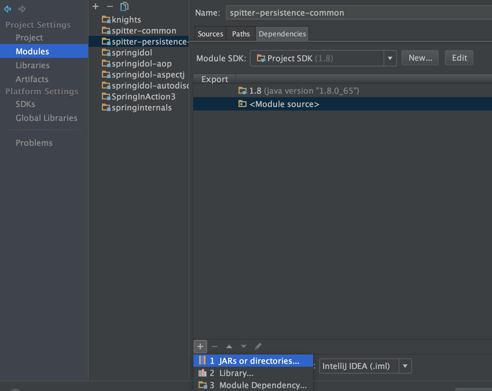
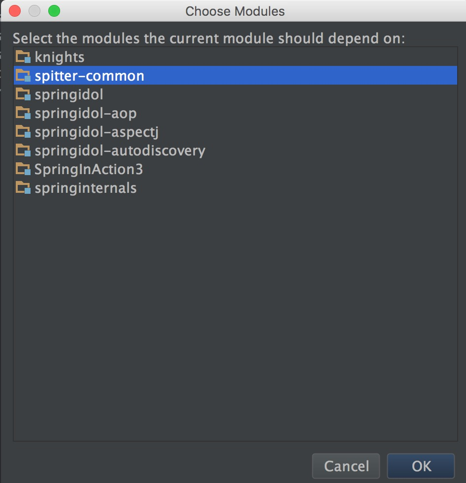
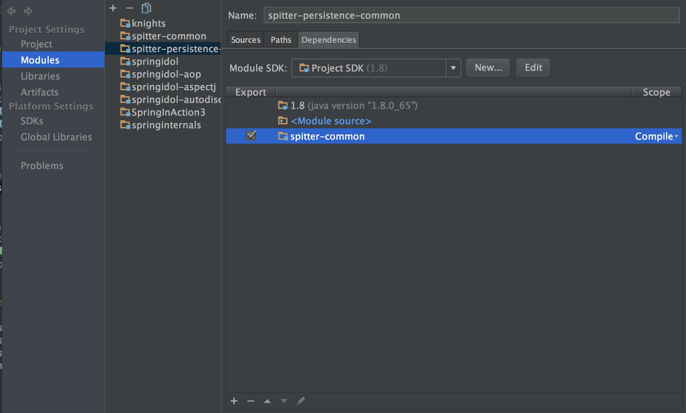

# IntelliJ idea 添加对另一个module的依赖

一个大型的项目由很多模块构建而成，所以会牵扯到一个module中的class对另一个module中class的依赖，在IntelliJ idea中配置过程如下。

1. File-> Project structure 打开项目结构 (Command+;)
2. 找到需要配置的module，选择 dependencies，点击左下角的“+” -> Module Dependency -> 选择需要的module即可
3. 最后勾选刚才选择的module，也可以配置scope

